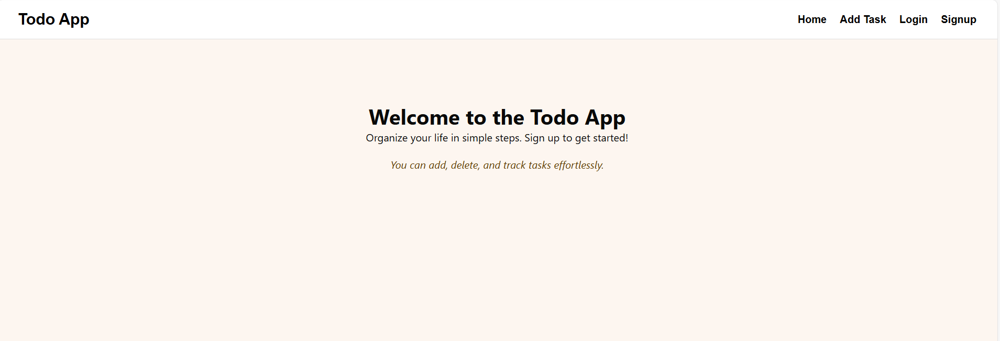
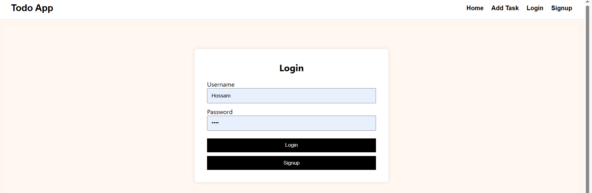
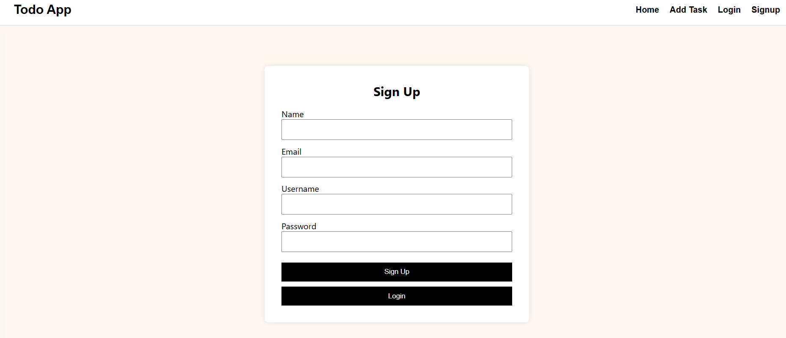
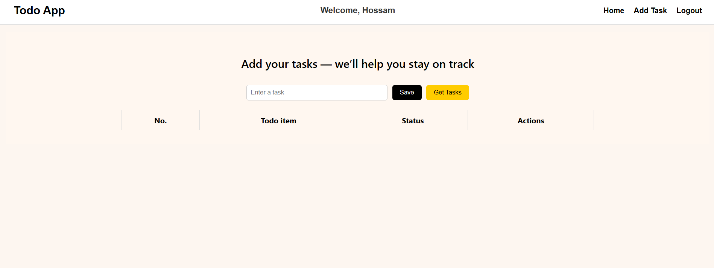
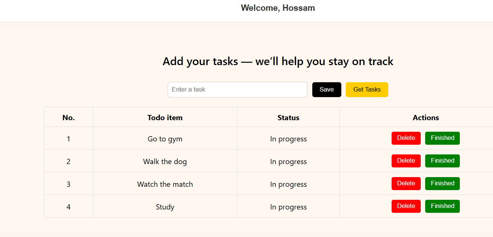
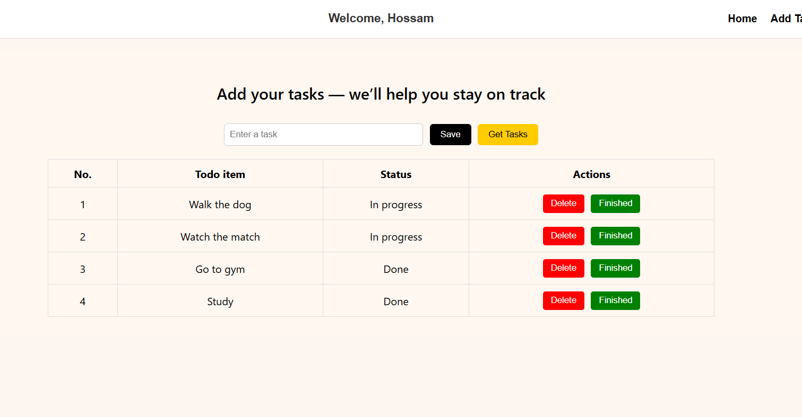
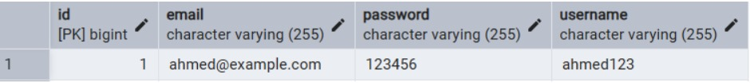
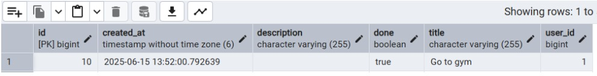

# ✅ Full Stack ToDo App

A complete **To-Do List web application** built with:

- 🧠 **Spring Boot** (Backend)
- ⚛️ **React** (Frontend)
- 🐘 **PostgreSQL** (Database)

> 📌 This project is mainly focused on **backend development** using Spring Boot. The frontend is kept intentionally minimal to support and interact with the API logic.

---

## 🛠 Features

- 🔐 User signup and login
- ➕ Add new tasks
- 📋 View all tasks
- ✅ Mark tasks as done
- ❌ Delete tasks
- 🔗 Link tasks to individual users

---

## 📸 Screenshots

### 🏠 Home Page


This is the default landing page of our app.  
To use the app, you must be **logged in** — only then can you add, track, and manage your tasks.

---

### 🔐 Login Page


This is the login form.  
You must already have an account. Enter your **username and password**.  
- If credentials are correct, you'll be logged in.
- If not, you'll need to [Sign Up](#signup-page) first.

---

### 👤 Signup Page


To create a new account, fill in your **name, email, username, and password**.  
- Username must be **unique**.  
- After signing up, you’ll be redirected to the login page to access the app.

---

### 📝 Task Page


Once you're logged in:
- You’ll see a welcome message with your name.
- The navbar will show a **"Logout"** option.
- You can now **add new tasks**, **view them**, and **track their status** easily.

---

### ✅ Added & Finished Tasks



These screenshots show tasks after being added:
- Each task has a number, a description, and a **status**.
- You can mark a task as **finished** (✔ green button) or delete it (❌ red button).
- If not finished, the task stays in "In Progress" state.
- Tasks are managed individually and provide clear feedback with each action.

---

### 🗄️ Database View

#### 👥 User Table


This shows how users are stored in the PostgreSQL database, including ID, username, and login details.

#### 📋 Task Table


Each task record includes:
- A **foreign key (user_id)** that links the task to the user who created it.
- This is a classic **Many-to-One** relationship — many tasks belong to one user.

---
## 🗂 Project Structure

```
FullStackToDoApp/
├── BackEnd/
│ └── ToDoList/ → Spring Boot backend (Java)
│
├── FrontEnd/
│ └── todo-frontend/ → React frontend (JavaScript)
│
├── ScreenShots/ → App and database screenshots used in README

```

---

---

## ⚙️ Backend – Spring Boot

The backend is where the main development effort is focused. It handles:

- RESTful API endpoints
- User and task management
- PostgreSQL database integration
- Clean architecture with layered structure (Controller, Service, Repository)

### 🔧 Tech Used:

- **Java 17+**
- **Spring Boot 3.5**
- **Spring Data JPA**
- **PostgreSQL**
- **Maven**

> Full details and implementation explained in [`BackEnd/ToDoList/README.md`](./BackEnd/ToDoList/README.md)

---

## 🖼 Frontend – React

The frontend is a simple, functional React app designed to consume the Spring Boot API.

### 🎨 Tech Used:

- **React**
- **Vite** (for fast bundling)
- **Axios** (for API requests)
- **Formik** (for forms)
- **Inline CSS styling** (no frameworks)

> I'm currently not focused on frontend skills, so this is a minimal UI to interact with the backend features.

---

## 🚀 Getting Started

### 1️⃣ Clone the Repository

```bash
git clone https://github.com/ahmedhossam32/FullStackToDoApp.git
Backend Setup
cd FullStackToDoApp/BackEnd/ToDoList
# Open in IntelliJ IDEA or run from terminal:
mvn spring-boot:run

Frontend Setup
cd FullStackToDoApp/FrontEnd/todo-frontend
npm install
npm run dev


